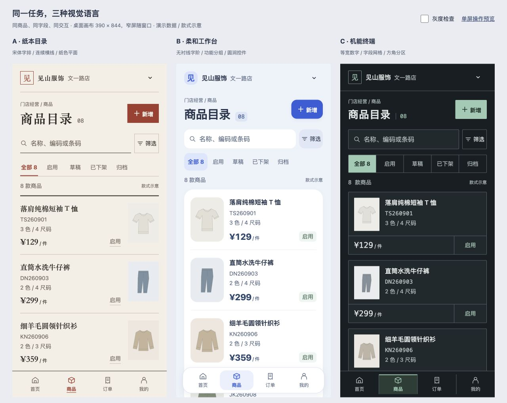

# Luo Skills

**Choose reusable Agent Skills by task and install each one independently.**

A growing collection of Agent Skills, each with its own use cases, examples, and installation instructions.

[中文](README.md) · English

[Website and live examples](https://luoqaq.github.io/luo-skills/) · [Install with your Agent](#recommended-ask-your-agent)

The repository currently contains **one Skill**, [`task-ui-prototype`](task-ui-prototype/SKILL.md). It guides an Agent from task and page scope to visual direction, a reference page, an interactive web prototype, and verification. Design references, visual presets, and examples ship with this Skill; they are not separate installs.



The included mobile examples compare typography, composition, and controls for the same product management task. They use demo data and illustrative product images. These directions are references, not a fixed menu.

## task-ui-prototype: What it helps with

- **Explore a visual direction.** Compare 2–3 runnable versions of a representative page while keeping its content, states, and actions consistent.
- **Build a usable flow.** Expand the chosen direction into the agreed pages, such as a product list, filters, detail view, and edit form, with relevant states and navigation.
- **Adapt to desktop and mobile tasks.** Reorganize information and controls for the target device instead of simply shrinking the desktop layout.
- **Learn from your feedback.** Keep scoped design preferences locally, with support for corrections, forgetting, and pausing recording.

The expected handoff includes prototype source, startup commands and a running URL, a design brief, verification results, and anything left unverified. A known direction can go straight to a reference page; you can also explicitly delegate the visual choice to the Agent.

This is a design and prototyping workflow. Mini program and native app concepts are represented as web prototypes. Demo data and simulated host features do not establish a working backend, real account integration, or native platform support. Marketing landing pages and static art are outside this Skill's scope. Verification depends on the Agent's available browser, screenshot, and file tools; missing checks must be reported.

## Install

### Recommended: Ask your Agent

Copy this request to an Agent with network, terminal, and file access:

```text
Install task-ui-prototype from https://github.com/luoqaq/luo-skills
into this Agent's personal skills directory. Install only this Skill.
Follow the repository README. If it already exists, inspect the installed
version and preserve my memory/ directory before updating.
Report the actual installation path and outcome.
```

### Alternative: Use the terminal

Use the third-party [skills CLI](https://github.com/vercel-labs/skills#readme) with Node.js, npm, and Git that meet its [version requirements](https://github.com/vercel-labs/skills/blob/main/package.json). The first `npx` run may download the installer. Back up existing personal memory before reinstalling or updating.

```sh
# List the available Skills without installing them
npx skills add luoqaq/luo-skills --list

# Install only task-ui-prototype for personal use in Codex
npx skills add luoqaq/luo-skills --skill task-ui-prototype --agent codex -g
```

For a project install, run the command in that project's root and omit `-g`. Replace `codex` with an [Agent name supported by the installer](https://github.com/vercel-labs/skills#supported-agents) if needed. Installer support does not mean this repository has been verified in every Agent. Avoid `--all` when you only intend to install this Skill: it also selects all Agents and skips confirmation.

### Manual installation

For manual installation, copy the **entire** `task-ui-prototype/` directory, including references, assets, and `.gitignore`, into your Agent's documented skills directory. Do not copy another user's `memory/`. See the [Chinese installation guide](README.md#方式三手动引入) for Codex paths, a Git archive command, and additional installation options.

## Use it

Confirm the installed directory contains `SKILL.md` and its referenced files, then name the Skill in your request. In Codex, you can use `$task-ui-prototype`; other Agents may have different invocation syntax.

```text
Use task-ui-prototype to design a mobile web prototype for a clothing
store manager. Include only the home page, product list, and product detail.
Treat this as a new design without copying an existing UI.
I have no visual direction yet; start with 2–3 runnable alternatives.
```

Specify the user, main actions, page scope, target device/platform, and any visual preferences. Say “Choose the visual direction and proceed” to delegate that decision.

To try it without installation, place the repository where your Agent can read it and ask it to follow the actual path to `task-ui-prototype/SKILL.md` and its referenced files for this task only. This does not ensure discovery in later tasks. Personal memory belongs to the loaded Skill directory and will not survive removal of a temporary copy.

## Preview locally

Run these commands from the repository root:

```sh
python3 scripts/build-site.py --out /private/tmp/luo-skills-site
python3 -m http.server 8770 --bind 127.0.0.1 --directory /private/tmp/luo-skills-site
```

The output directory must be new or empty. For another build, choose a different directory in both commands. The builder does not delete or overwrite existing files.

Open the [local introduction and example links](http://127.0.0.1:8770/). This builds and serves local files; it does not publish a website. The address is accessible only on the computer running the server.

The [Chinese preview guide](README.md#预览样板) also includes commands to serve the desktop and mobile examples individually. Browser prototypes do not establish testing on physical devices, mini program hosts, or native apps.

## Updates and personal memory

The Skill stores design feedback in `memory/preferences.md` under the **actual loaded Skill directory**, following its [preference rules](task-ui-prototype/preference-memory.md). Personal records are excluded from Git; they are not encrypted, backed up, or synchronized automatically. You can ask the Agent to forget a record, pause recording, or ignore history for a task.

Before an update or reinstall, back up your own `memory/` **outside the installation directory**, verify which copy is loaded (including symlink targets), then update the shared files and restore your records. Installers may replace the whole directory, so Git ignore rules are not protection against an update.

Keep personal records out of copies shared with other users. Separate installations do not automatically synchronize memory. If the Agent cannot write to the directory, it should apply the feedback only to the current task and report that it was not saved.
